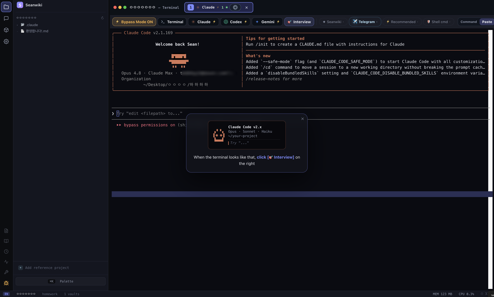

<div align="center">

# Seanwiki

**Obsidian과 Claude Code를 하나로 묶은, 나만의 지식 백과사전.**

Obsidian과 Claude Code를 하나의 vault로 연결하는 macOS 앱입니다.
내가 대화하는 AI가, 내가 쌓아 둔 노트를 직접 읽고 거기에 정리해 넣습니다.

<p>
  <a href="https://github.com/IT-Yun/seanwiki-releases/releases/latest"></a>
  <a href="LICENSE"></a>
  
  <a href="https://github.com/IT-Yun/seanwiki-releases/releases"></a>
  <a href="https://github.com/IT-Yun/seanwiki-releases/stargazers"></a>
</p>

<p>
  
  
  
  
  
</p>

<br>



<br><br>

[English](README.md) · **한국어**

</div>

> 이 저장소는 **배포(릴리즈) 전용**입니다. 소스 코드는 당분간 비공개이며, 이곳에서는
> 서명된 설치 파일을 받고, 검증하고, 설계 의도를 확인한 뒤 나에게 맞는지 판단할 수 있습니다.
> 쓸 만해 보인다면 ⭐ 하나가 다른 사람들이 이 프로젝트를 발견하는 데 큰 도움이 됩니다.

---

## 왜 만들었나

메모는 Obsidian에 계속 쌓이는데 정작 필요할 때는 찾지 못하고, Claude와는 매번 처음부터 맥락을 다시 설명해야 했습니다. 둘 다 좋은 도구지만 따로 쓰니 서로의 장점을 살리지 못했습니다.

Seanwiki는 이 둘을 하나로 이어 붙입니다. **Obsidian이 장기 기억을 맡고, Claude가 그 기억을 읽고 정리하고 일관되게 유지하는 엔진이 됩니다.**

시작할 때 진행하는 짧은 인터뷰가 핵심입니다. AI에게 내가 누구이고, 무엇을 기록하며, 어떤 결과물을 원하는지 한 번 알려 주면, 그 내용이 `CLAUDE.md`와 `AGENTS.md`에 저장되어 이후 모든 대화가 같은 맥락에서 시작합니다. 매번 나를 다시 설명할 필요가 없습니다.

---

## 어떤 도구인가

약 135 MB짜리 macOS 앱입니다. 드래그 한 번으로 설치되고, 백그라운드 서비스나 데몬, 메뉴바 아이콘은 기본적으로 없습니다.

처음 실행하면 **Obsidian**과 **Claude Code** 두 카드가 보입니다. 각각 눌러 설치하면 됩니다(둘 다 무료, 둘 다 로컬에서 동작). 준비는 이게 전부입니다.

**`+ 새 프로젝트`** → 카테고리 선택 → 폴더 지정 → 터미널에서 3~5개 질문에 답하면, 6분 뒤 vault가 다음과 같이 만들어집니다.

```
<vault>/
├── CLAUDE.md              ← 매 AI 턴마다 자동으로 읽히는 나의 규칙
├── AGENTS.md              ← 같은 규칙의 cross-AI 버전 (Codex / Cursor / Aider도 따름)
├── 나의 핵심 맥락.md       ← 인터뷰 답변으로 채워지는 정체성 파일
│
├── inbox/                 ← 드롭존. 무엇이든 일단 던져 넣는 곳.
├── raw/                   ← 불변 원본 보관소. AI가 절대 수정하지 못함.
│   ├── benchmarks/
│   ├── inspiration/
│   ├── research/
│   └── ...
│
├── wiki/                  ← Claude의 해석본이 쌓이는 공간
│   ├── index.md           ← 목차 (페이지마다 한 줄)
│   └── log.md             ← 의미 있는 작업이 한 줄씩 기록되는 로그
│
├── Output/                ← 최종 결과물 (초안 / PDF / 내보내기)
│
└── .claude/skills/        ← 직접 수정할 수 있는 슬래시 커맨드
    ├── ingest/SKILL.md    ← inbox 정리 → 분류 → raw/로 이동 → wiki/ 갱신
    ├── query/SKILL.md     ← wiki에 질문하면 [[wikilink]] 인용과 함께 답변
    ├── lint/SKILL.md      ← 상태 점검 (고아 페이지 / 깨진 링크)
    └── <카테고리별 추가 커맨드>
```

## 실제 사용 예

| 상황 | 동작 |
|---|---|
| **스크린샷을 모은다** | `inbox/`로 끌어다 놓으면 Claude가 내용을 파악해 `raw/`의 알맞은 폴더로 옮기고 `wiki/log.md`에 기록합니다. |
| **wiki에 질문한다** | `/query "인증 흐름은 어떻게 결정했더라?"` → 관련 페이지를 찾아 `[[wikilink]]` 인용과 함께 답합니다. 모든 답은 `raw/` 원본까지 추적 가능합니다. |
| **규칙을 바꾼다** | `CLAUDE.md`를 고쳐 저장하면 그 시점부터 모든 세션이 새 규칙을 따릅니다. 재학습도, 재설정도 없습니다. |
| **커맨드를 추가한다** | `.claude/skills/`에 `SKILL.md`를 하나 만들면 다음 실행부터 Claude가 인식합니다. |

전부 평범한 마크다운 파일이라, Seanwiki가 없어도 vault는 어떤 에디터에서든 그대로 열립니다.

---

## 설계 원칙 5가지

**1. 업데이트는 수동만.** 자동 업데이트는 계정이 탈취되거나 서명 키가 유출되면 악성 바이너리를 그대로 퍼뜨릴 수 있는 통로입니다. 그래서 넣지 않았습니다. 모든 릴리즈에 `ed25519` 서명과 SHA-256 해시가 함께 제공되고, 사용자가 직접 받고 검증합니다.

**2. 100% 로컬.** 텔레메트리도, 라이선스 확인도, 사용 통계 수집도 없습니다. 사용자가 직접 켜기 전에는 어떤 데이터도 기기 밖으로 나가지 않습니다. 자체 포맷이 아닌 마크다운을 쓰는 이유도 같습니다 — 도구가 사라져도 데이터는 남습니다.

**3. 외부 통신은 기본 꺼짐.** Telegram 연동, 플러그인 자동 설치, 외부 API 호출 모두 기본값이 '꺼짐'입니다. 필요할 때만 채널별로 직접 켭니다.

**4. `raw/`는 불변.** AI가 "정리"하다가 원본을 고쳐 버리는 일은 없습니다. AI가 쓸 수 있는 곳은 `wiki/`뿐이고, 모든 해석은 `[[wikilink]]`로 원본까지 추적됩니다. 마음에 안 드는 해석은 원본은 둔 채 `wiki/`만 고치면 됩니다.

**5. 템플릿이 아니라 인터뷰.** 일반 템플릿은 사용자를 추측하지만, 인터뷰는 직접 묻고 그 답을 `CLAUDE.md`·`AGENTS.md`에 새깁니다. kickoff 프롬프트는 앱의 **Prompt Setting**에서 언제든 직접 수정할 수 있고, 한 번 고치면 이후 프로젝트에도 적용됩니다.

---

## 다운로드

### 1단계 — 내 Mac의 칩 확인

Apple 메뉴 → **이 Mac에 관하여** → "칩" 항목을 확인합니다.

- **Apple M1 / M2 / M3 / M4** → **Silicon** 빌드
- **Intel** → **Intel** 빌드

잘못 받으면 Rosetta를 거쳐 실행은 되지만, 더 느리고 배터리도 더 씁니다.

### 2단계 — 파일 받기

최신 버전은 **v2.0.1**입니다. [Releases](https://github.com/IT-Yun/seanwiki-releases/releases/latest)에서 내 아키텍처에 맞는 파일을 같은 폴더로 받습니다.

아키텍처마다 **두 가지 포맷**이 있습니다. 둘은 완전히 같은 앱이니 편한 쪽으로 받으면 됩니다.

- **`.dmg`** — "더블클릭 → 앱을 Applications로 드래그"하는 전통적인 설치 이미지. 바로 실행하고 싶다면 이쪽.
- **`.zip`** — 같은 앱을 압축한 파일. 아래 검증 스크립트를 먼저 돌려보고 싶다면 이쪽.

| 아키텍처 | `.dmg` (드래그 설치) | `.zip` (검증 후 설치) | 서명 |
|---|---|---|---|
| **Apple Silicon** (M1–M4) | `Seanwiki.Silicon-2.0.1-arm64.dmg` (~140 MB) | `Seanwiki.Silicon-2.0.1-arm64-mac.zip` (~135 MB) | 짝이 되는 `…​.sig` (89 B) |
| **Intel** | `Seanwiki.Intel-2.0.1.dmg` (~140 MB) | `Seanwiki.Intel-2.0.1-mac.zip` (~140 MB) | 짝이 되는 `…​.sig` (89 B) |

`.sig` 파일은 89바이트밖에 안 되니, 본체와 **같은 폴더에** 함께 받아야 검증이 됩니다.

zip(또는 마운트한 `.dmg`) 안에는 앱 하나가 들어 있고, 이름은 아키텍처마다 다릅니다.

- Apple Silicon → **`Seanwiki Silicon.app`**
- Intel → **`Seanwiki Intel.app`**

(칩 이름을 일부러 파일명에 넣었습니다. 한 Mac에 둘 다 있어도 구분되도록요.)

#### 또는 터미널에서 바로 받기 (브라우저 없이 한 번에)

칩을 자동 감지해 맞는 `.zip`과 `.sig`를 현재 폴더로 받습니다.

```bash
# 1) 내 Mac 칩에 맞는 파일 자동 선택
#    (hw.optional.arm64 == 1 이면 Apple Silicon — Rosetta 셸 안에서도 정확함)
if [ "$(sysctl -in hw.optional.arm64 2>/dev/null)" = "1" ]; then
  FILE="Seanwiki.Silicon-2.0.1-arm64-mac.zip"
else
  FILE="Seanwiki.Intel-2.0.1-mac.zip"
fi
BASE="https://github.com/IT-Yun/seanwiki-releases/releases/download/v2.0.1"

# 2) 앱 + 서명 파일을 현재 폴더로 다운로드
curl -L -o "$FILE"     "$BASE/$FILE"
curl -L -o "$FILE.sig" "$BASE/$FILE.sig"

echo "받음: $FILE  ($(du -h "$FILE" | cut -f1))"
```

(GitHub CLI가 있다면 한 번에: `gh release download v2.0.1 -R IT-Yun/seanwiki-releases -p "Seanwiki.*"` — 특정 아키텍처만 받으려면 `-p "*Silicon*"` 또는 `-p "*Intel*"`)

받은 뒤에는 검증(3단계) → 압축 풀기 → 앱을 `/Applications/`로 드래그합니다.

### 3단계 — 설치 전 검증

10초면 끝나는 단계로, 변조된 파일로부터 나를 지키는 마지막 방어선입니다. 이 저장소를 clone하거나 `scripts/` 안의 두 파일만 받은 뒤, 받은 파일을 스크립트에 넘깁니다.

```bash
cd <파일-받은-폴더>
# Apple Silicon:
bash <verify-스크립트-경로>/scripts/verify-release.sh "Seanwiki.Silicon-2.0.1-arm64-mac.zip"
# Intel:
bash <verify-스크립트-경로>/scripts/verify-release.sh "Seanwiki.Intel-2.0.1-mac.zip"
```

스크립트는 같은 폴더의 짝 `.sig`를 자동으로 찾습니다. 성공하면 다음과 같이 출력됩니다.

```
→ Verifying: Seanwiki.Silicon-2.0.1-arm64-mac.zip

  computed SHA-256: 8b3c0a613cc54bff0664d650f01b86edd4566a9e9af21113a70a9547f8507cdb

→ Verifying ed25519 signature against published public key
  ✓ ed25519 signature VERIFIED

✓ Verification complete. Safe to drag into /Applications/.
```

**검증에 실패하면 파일을 지우고 다시 받으세요. 설치하면 안 됩니다.** 전송 중 손상되었거나 누군가 변조한 것이며, 둘 다 새로 받으면 해결됩니다.

#### 공개 SHA-256 (v2.0.1)

스크립트 없이 해시만 직접 비교하려면 `shasum -a 256 <파일>`을 실행해 아래와 대조하세요.

| 파일 | SHA-256 |
|---|---|
| `Seanwiki.Silicon-2.0.1-arm64-mac.zip` | `8b3c0a613cc54bff0664d650f01b86edd4566a9e9af21113a70a9547f8507cdb` |
| `Seanwiki.Silicon-2.0.1-arm64.dmg` | `bd67fec938dc1a833a1487ee305c72fa5999f63853c2e54b98470e8a21c271b1` |
| `Seanwiki.Intel-2.0.1-mac.zip` | `a49ac024181627dc68eb90fd2c8379179ce7c243ab8667c1156dc72d2ba2ca55` |
| `Seanwiki.Intel-2.0.1.dmg` | `79d2c63ea74789e7e6a5aaed8d2156ddb1311ba691d1a8818823b3d502b51396` |

공개키 (`scripts/seanwiki-pubkey.txt`):

```
nzi9RYywbRu//kXHVt8aNI0w5U2i2g/YZI0u65QsNc8=
```

제가 서명에 쓰는 유일한 키입니다. 앞으로의 릴리즈가 다른 키로 검증된다면 **제가 만든 것이 아닙니다.**

### 4단계 — 설치

**`.dmg`로 설치:** 더블클릭하면 앱과 `Applications` 바로가기가 보입니다 → 앱을 `Applications` 위로 드래그하면 끝입니다. 끝나면 디스크 이미지는 추출(eject)하세요.

**`.zip`으로 설치:** 더블클릭으로 압축을 풀거나(터미널에서는 `unzip "Seanwiki.Silicon-2.0.1-arm64-mac.zip"`) 앱이 나오면 `/Applications/`로 드래그합니다.

어느 쪽이든 드래그하는 앱은 `Seanwiki Silicon.app`(Apple Silicon) 또는 `Seanwiki Intel.app`(Intel)입니다.

### 5단계 — 첫 실행 (중요 — Gatekeeper 우회)

현재는 ad-hoc 서명이라(Developer ID 서명은 배포 규모가 커지면 도입 예정) 첫 실행 때 Gatekeeper가 다음 메시지로 앱을 막습니다.

> **"Apple이(가) 'Seanwiki Silicon'에 Mac에 손상을 입히거나 사용자의 개인정보를 침해할 수 있는 악성 소프트웨어가 없음을 확인할 수 없습니다."**

(Intel Mac이면 "Seanwiki Intel"로 표시됩니다.) ad-hoc 서명 앱에서는 **정상**이며, 진짜 악성코드 경고가 아니라 "개발자를 확인할 수 없다"는 안내입니다. macOS 버전에 맞춰 아래 셋 중 하나를 따르세요.

**옵션 A — macOS Sequoia (15.0 이상)**

Sequoia부터는 예전의 '우클릭 → 열기'가 사라졌습니다.

1. 앱을 더블클릭하면 "확인할 수 없음" 창이 뜹니다.
2. **완료**를 누릅니다. (절대 **"휴지통으로 이동"을 누르지 마세요.** 앱이 삭제됩니다.)
3.  → **시스템 설정** → **개인정보 보호 및 보안**을 엽니다.
4. **맨 아래까지 스크롤**해 **보안** 섹션을 봅니다. *"Seanwiki Silicon은(는) 확인된 개발자의 것이 아니므로 차단되었습니다"* 같은 문구 옆의 **확인 없이 열기** 버튼을 누릅니다.
5. 확인 창이 한 번 더 뜨면 **확인 없이 열기**를 다시 누르고 Touch ID 또는 로그인 암호로 인증합니다.
6. 앱이 실행됩니다. 이후로는 더블클릭만으로 열리며, 이 과정은 한 번만 하면 됩니다.

> **확인 없이 열기** 버튼이 안 보이면 1번을 건너뛴 것입니다. macOS는 앱을 *한 번 열려고 시도해 차단된 직후에만* 이 버튼을 보여줍니다.

**옵션 B — macOS Sonoma (14) 이하**

1. 앱을 우클릭(또는 Control+클릭) → **열기**
2. 창이 뜨면 → **열기**
3. 끝입니다. (이후로는 더블클릭으로 열립니다.)

**옵션 C — 터미널 한 줄 (모든 macOS 공통, 가장 빠름)**

Apple의 quarantine 플래그를 직접 제거하는 방법으로, 위 보안 설정과 똑같은 동작을 명령어로 하는 것뿐입니다.

```bash
# Apple Silicon:
xattr -dr com.apple.quarantine "/Applications/Seanwiki Silicon.app"
# Intel:
xattr -dr com.apple.quarantine "/Applications/Seanwiki Intel.app"
```

그다음 앱을 더블클릭하면 창 없이 바로 열립니다. (`xattr -cr "<경로>"`도 되지만, 이쪽은 *모든* 확장 속성을 지웁니다.)

> **왜 이런 일이 생기나요?** macOS는 인터넷에서 받은 파일에 `com.apple.quarantine` 플래그를 붙입니다. 유료 Apple Developer ID로 서명된 앱이면 Gatekeeper가 그냥 통과시키지만, 이 빌드는 ad-hoc 서명이라(아직 유료 인증서 없음) 개발자를 식별하지 못해 막습니다. 한 번 직접 허용하면 풀립니다. 앱이 위험하다는 뜻이 아니라 Apple에 보증 비용을 내지 않았다는 뜻이며, 그래서 릴리즈마다 별도의 ed25519 키로 서명해(3단계) Apple에 기대지 않고도 검증할 수 있게 했습니다.

### 6단계 — 처음 보이는 화면

처음 화면에는 **Obsidian**과 **Claude Code** 카드가 있습니다. 각각 누르면 공식 다운로드 페이지가 열리며, 둘 다 무료이고 1분이면 설치됩니다. 둘 다 설치했으면 오른쪽 위 **`+ 새 프로젝트`** 를 누르고 안내를 따라가면 됩니다.

---

## 설치 후 — 첫 10분

1. **카테고리 선택.** 기본 5종(앱 만들기 / 업무·기업 / 학교 과제 / 일반 프로젝트 / 웹사이트) 중 가장 가까운 것을 고릅니다. 규칙은 나중에 바꿀 수 있습니다.
2. **폴더 지정.** Obsidian에서 vault를 고르거나 Finder에서 기존 폴더를 선택합니다. 그 폴더가 프로젝트 루트가 됩니다.
3. **터미널에서 인터뷰 시작.** Claude가 짧은 질문 3~5개를 합니다. 솔직하게 답할수록 vault가 나에게 잘 맞춰집니다.
4. **파일이 실시간으로 생성됨.** 답하는 동안 Claude가 `CLAUDE.md`, `AGENTS.md`, `나의 핵심 맥락.md`, `raw/` 하위 폴더, `.claude/skills/`까지 작성합니다. Finder에서 그대로 지켜볼 수 있습니다.
5. **마지막에 한 줄로 마무리.** "✅ 셋업 완료 — 7개 산출물 생성됨."

이제 원래 하려던 일을 하면 됩니다. `inbox/`에 자료를 넣고, `/query`로 질문하고, Obsidian에서 파일을 엽니다. 전부 마크다운입니다.

---

## 업데이트

설치와 같은 흐름입니다. 새 `.zip`과 `.sig`를 받아 검증한 뒤, 새 `.app`을 `/Applications/`로 드래그합니다(macOS가 "바꾸시겠습니까?"라고 물으면 예).

앱은 **스스로 업데이트를 확인하지 않습니다.** 알림도 띄우지 않습니다. 새 버전은 이 버전을 알게 된 경로(LinkedIn, GitHub Releases, 입소문)를 통해 같은 방식으로 받으면 됩니다.

---

## 이슈 / 피드백

이 저장소에 이슈를 남기거나 LinkedIn으로 연락 주세요. 설계상 어색하거나 바꾸고 싶은 기본값이 있으면 알려 주시면 됩니다.

---

## 라이선스

[MIT](LICENSE) © Seung yun Lee

소스 저장소는 현재 비공개입니다. 안정화되면 공개를 논의할 수 있습니다.

---

<div align="center">

Seanwiki가 시간을 아껴 주었다면, ⭐ 하나가 다른 사람들이 이 프로젝트를 발견하는 데 도움이 됩니다.

<sub>구조 일부 — JSON 파일 기반 상태 관리, git-worktree 워커 격리, 수동 서명 업데이트 —
는 [Octo](https://github.com/anthropics/octo)와 OMC의 패턴을 참고했습니다.</sub>

</div>
